# demo-for-IdeaModuleWebapp
* `A` - 建立maven项目
* `B` - 建立maven项目的子模块
* `C` - 配置子模块的web框架
* `D` - hello world
* `E` - 使用maven构建生成(可跳过)
* `F` - 配置tomcat: 参考https://github.com/SailHe/demo-for-idea-module-web
* `G` - 调试运行
*  `A` 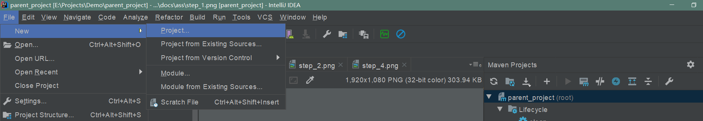
*  `A` 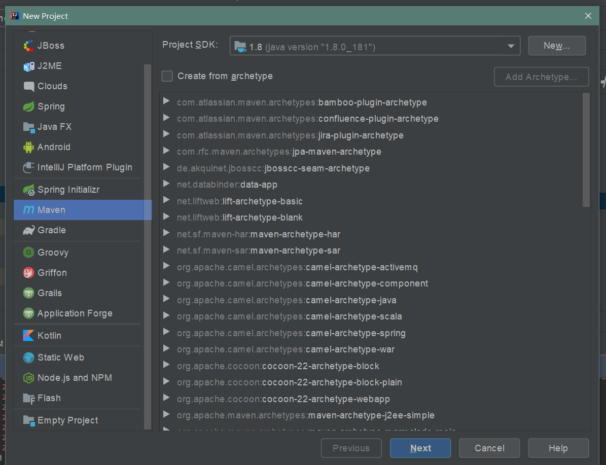
*  `A` 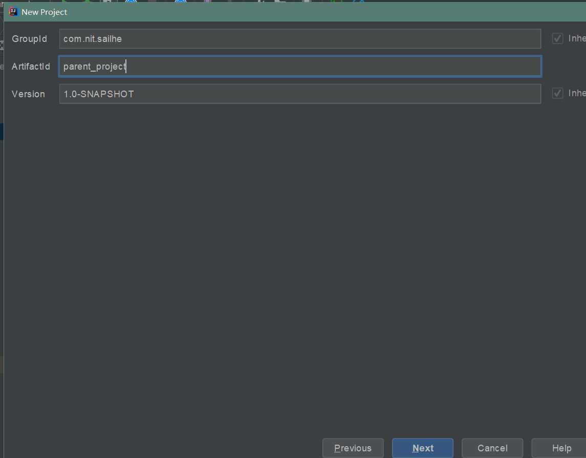
*  `B` 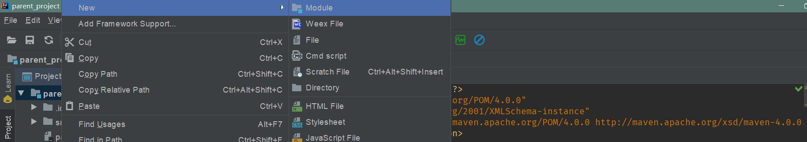
*  `B` 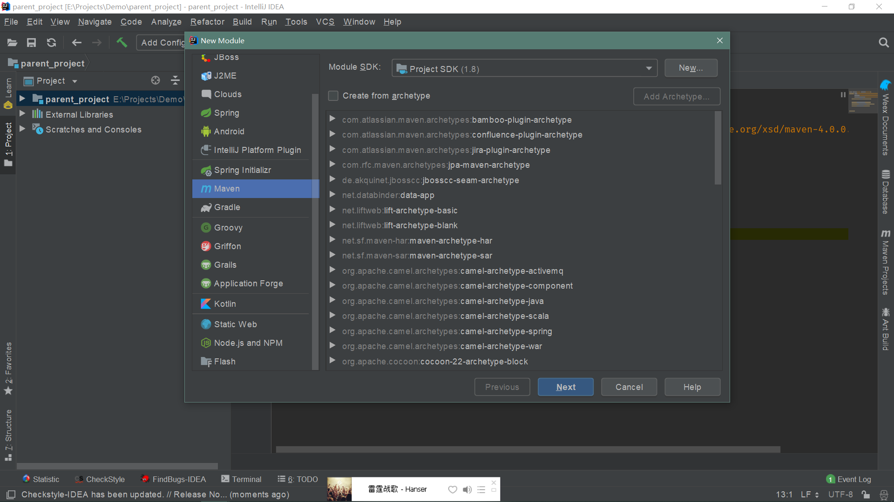
*  `B` 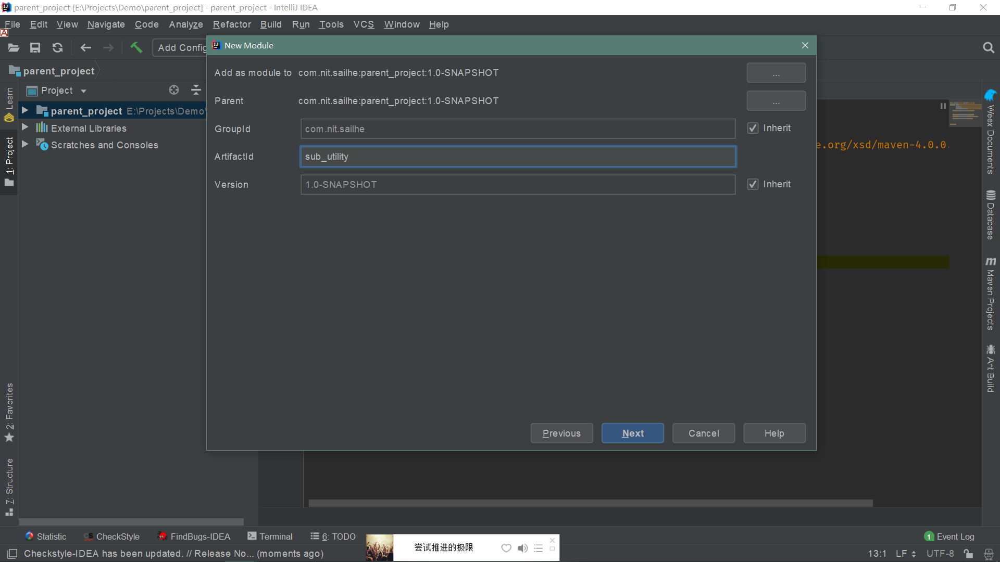
*  `B` 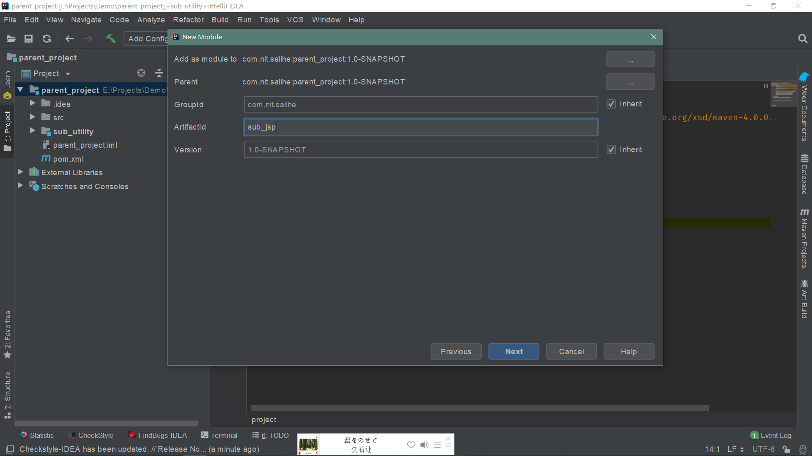
*  `C` 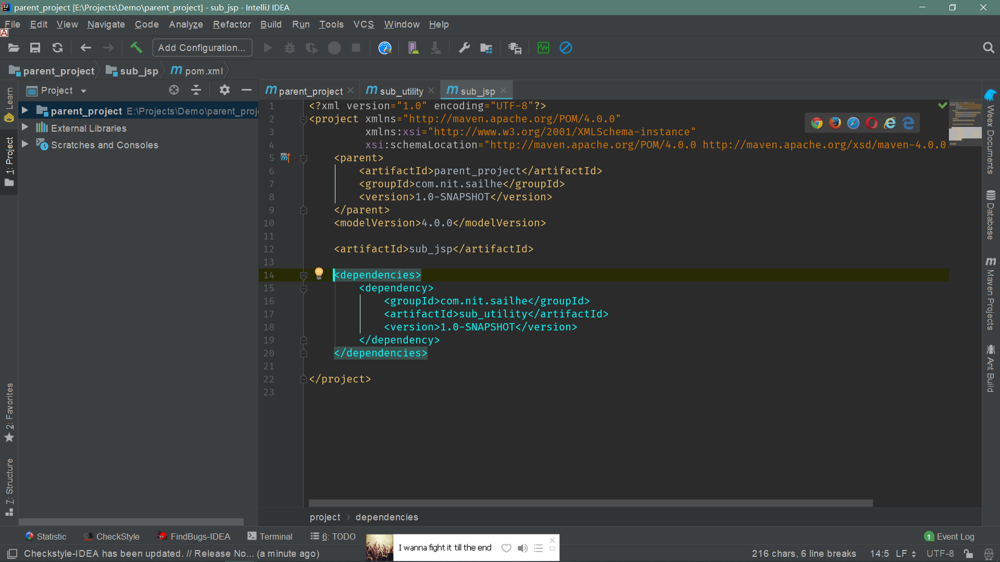
*  `C` 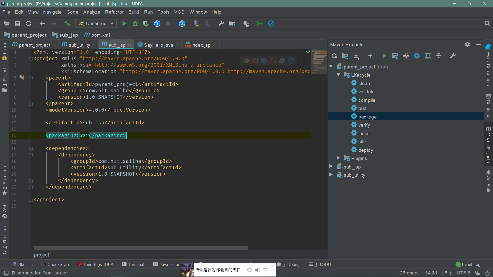
*  `D` 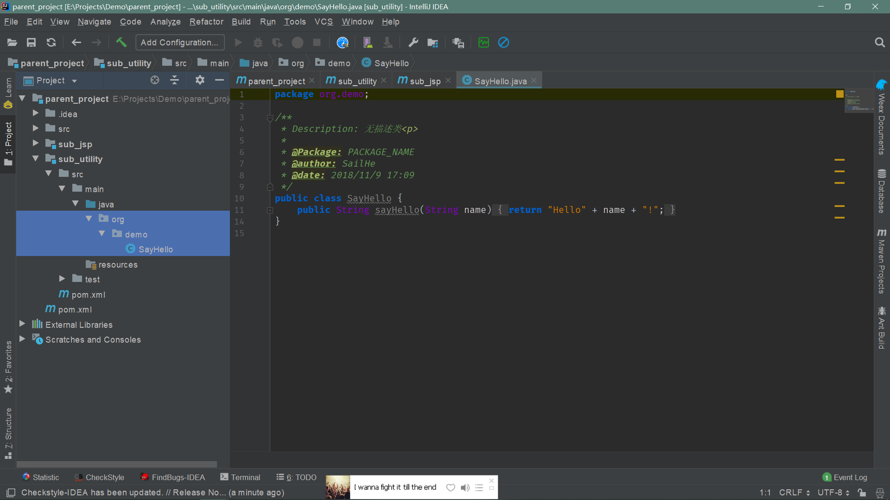
*  `C` 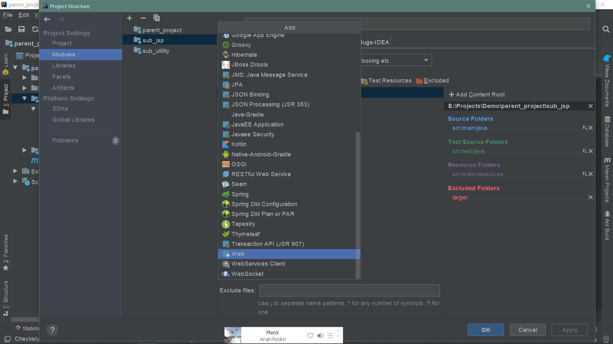
*  `C` 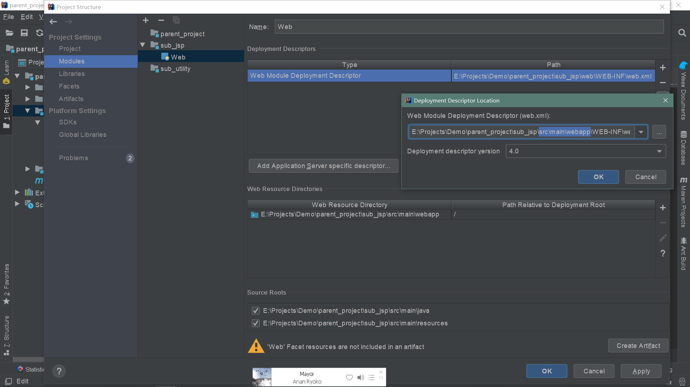
*  `C` 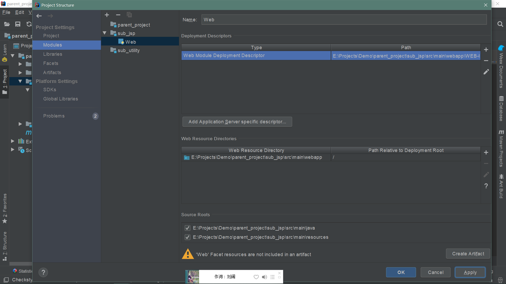
*  `D` 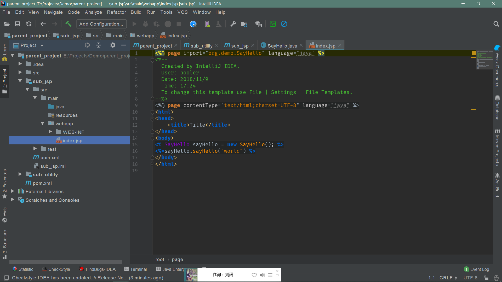
*  `E` 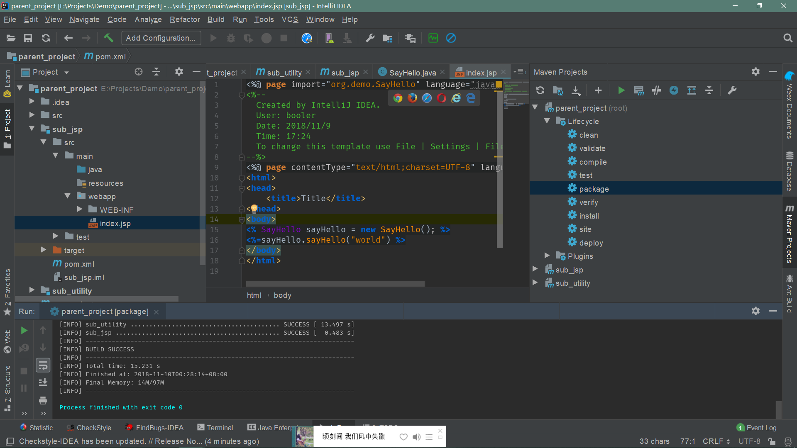
*  `G` 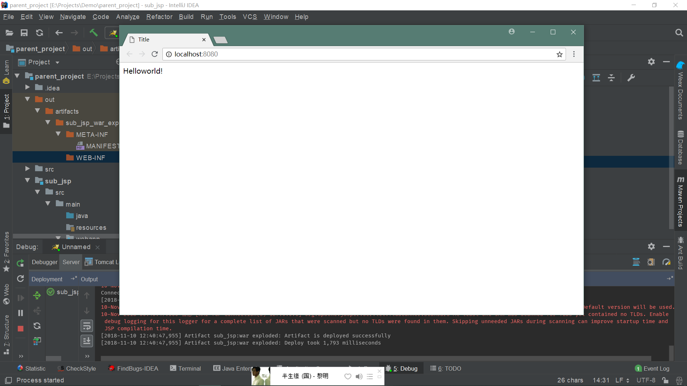
